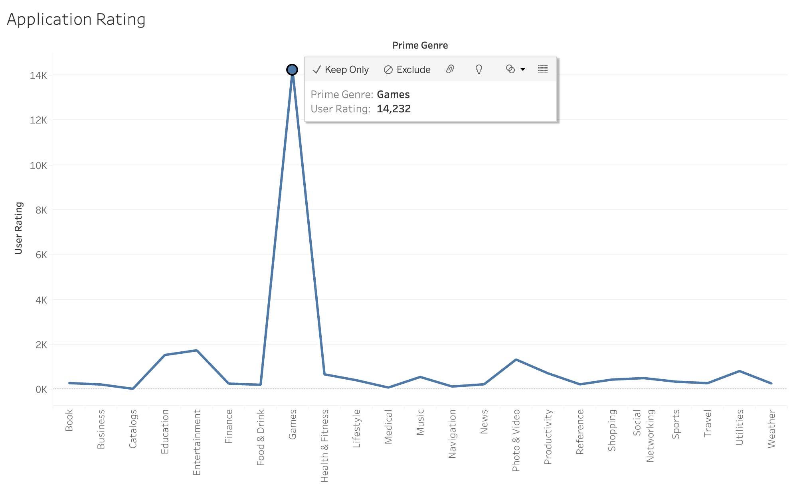
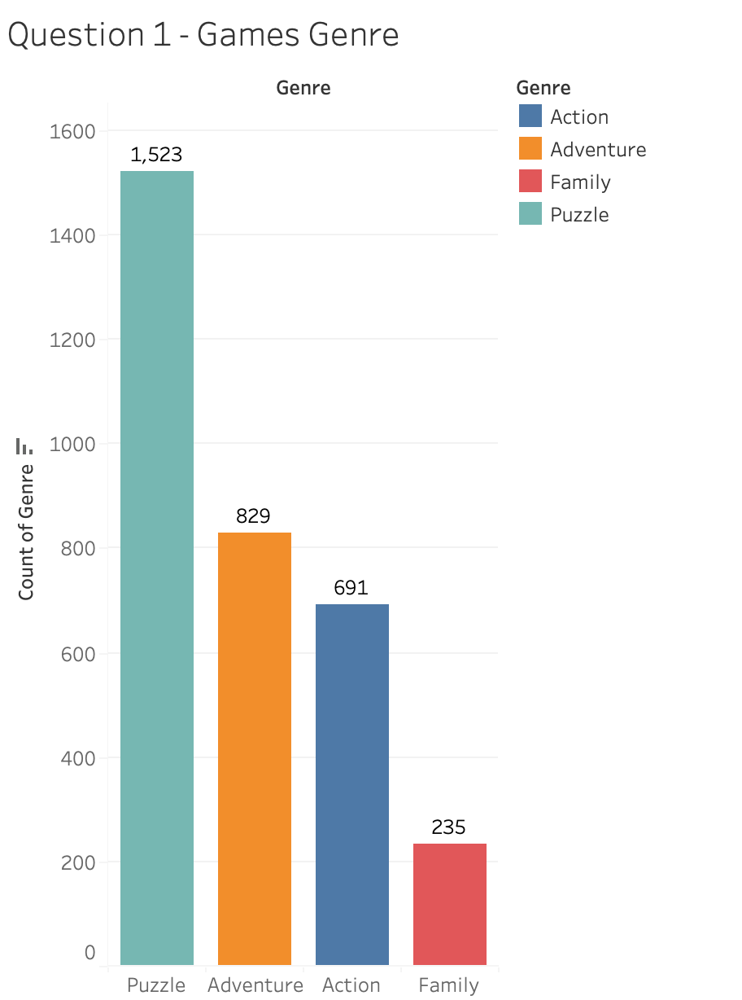
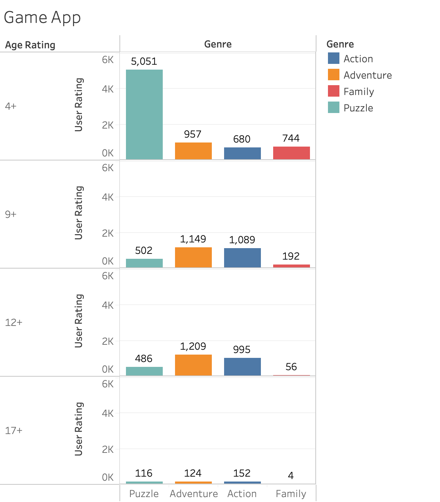

HW 8, CS 625, Spring 2023
================
Manjushree Muralidhara
Apr 20, 2023

## Title - Profitable app to develop

To find the best and most profitable application to develop I have
chosen *AppStore data* and then data which has the *Games application
review data* where I can find the most popular genre

Appstore data -
(<https://www.kaggle.com/datasets/ramamet4/app-store-apple-data-set-10k-apps>)

In this data we have all the application in the appstore

DataSet Information - There are 23 different genres of Application There
are 7,195 application and

Data collection date (from API); July 2017

Dimension of the data set; 7197 rows and 16 columns

Content: appleStore.csv  
\* Id : App ID.  
\* track_name: App Name.  
\* size_bytes: Size (in Bytes).  
\* currency: Currency Type.  
\* price: Price amount.  
\* rating_count_tot: User Rating counts (for all version).  
\* rating_count_ver: User Rating counts (for current version).  
\* user_rating : Average User Rating value (for all version).  
\* user_rating_ver: Average User Rating value (for current version).  
\* ver : Latest version code.  
\* cont_rating: Content Rating  
\* prime_genre: Primary Genre.  
\* lang.num: Number of supported languages.  
\* vpp_lic: Vpp Device Based Licensing Enabled.

Game Development data -
(<https://www.kaggle.com/code/hkhoi91/data-viz-what-to-focus-on-as-a-game-dev/input>)

We can find the below columns in the dataset which can be used as
individual attributes to compare to gain more information on the
popularity and to decide which kind of application would be a great
investment

- ID
- Name - The name
- User Rating - Rounded to nearest .5, requires at least 5 ratings
- User Rating Count - Number of ratings internationally, null means it
  is below 5
- Price - Price in USD
- In App Purchase - Prices of available in-app purchases
- Age - Age Rating
- Languages - Languages the apps are available in
- Size - Size of the app
- Primary Genre - The primary genre of the apps
- Genre - The Game Genre
- Release Date - The release date of the game
- Current Version Date - Current version releaase date
- Update Gap - The gap between updates

## Question - What is the Most popular Gener in games ? What would be the a profitable genre of app to develop?

So this would help us to find the most downloaded/popular application
genre that would mean it will be a good start for development

This was the most popular primary genre of application which we have
generated 

HW7 data - We found that the most popular genre was Games so we got the
reviews and deep informative dataset of game apps

Simple Analysis on Genre distribution, we can see that number of games
follows Puzzle \> Adventure \> Action \> Family

## Final Refined chart

- Here in the refined chart we get more information about which would be
  the group to approach and how the app should be built

Final Refined chart explains the trend of games in different age groups:

4+ age group - Puzzles with more colorful background would be more
approachable for this age group

9+ and 12+ age group - Adventure and Action Gaming action would be a
good option

17+ age group - Any genre of game with more informative content would be
good

Observation - Gaming application with colorful background and puzzles
genre would be a good application to build as it has most User Reviews
and downloads

- In the refined chart I have used the bar chart to analyse the solution
  -

X- axis - Game genres  
Y axis has User Ratings and Age Ratings - Here I have added age group so
we can know the know what should be the content in the application and
which kind of animation and user interface should be built

Bar helps us to easily compare between different categories

## Final Thoughts

It was a step by step approach of learning data visualization though out
the course.  
The final assessment broken into three parts was very helpful to get
clarity on how the Visualization process works.  
It took a little longer to select the dataset since we dint know which
topic to select but after that it was a smooth flow as we were able to
see the data, come up with questions, build charts and get solutions.

## References

- Dataset,  
  Appstore data,
  <https://www.kaggle.com/datasets/ramamet4/app-store-apple-data-set-10k-apps>

Game Development data -
<https://www.kaggle.com/code/hkhoi91/data-viz-what-to-focus-on-as-a-game-dev/input>

- Tableau Topics,
  <https://www.simplilearn.com/tutorials/tableau-tutorial/what-is-tableau>

- Open Refine Tutorials,
  <https://multimedia.journalism.berkeley.edu/tutorials/openrefine/>

- Rstudio, <https://rmarkdown.rstudio.com/authoring_basics.html>
